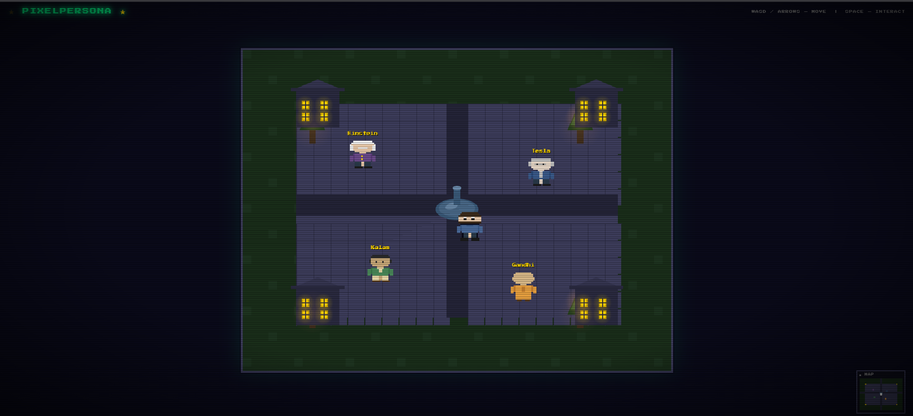

# PixelPersona — Meet the Great Minds



An interactive RAG-powered chatbot wrapped in a retro 2D browser game. Walk up to historical figures wandering a pixel-art village and chat with them in real-time — responses are grounded in their actual biographies, quotes, and writings.

---

## Architecture

```
Browser (Frontend)          FastAPI (Backend)              External Services
┌──────────────┐           ┌──────────────────┐           ┌────────────────┐
│  HTML5 Canvas │  SSE  →  │  LangGraph Agent  │  ──HTTP──→│  GroqCloud API │
│  Vanilla JS    │  ←──    │  + RAG Pipeline   │           │  (LLM + Embed) │
└──────────────┘           │                  │           └────────────────┘
                           │  Chroma (local)  │
                           │  BGE Embeddings  │
                           └──────────────────┘
```

**Request flow:**
1. User sends message from chat modal in browser
2. `POST /chat` receives the query
3. LangGraph ReAct agent decides whether to retrieve from knowledge base
4. If retrieval is needed: query rephrased → embedding → Chroma similarity search → top-k chunks
5. Retrieved context is injected into the prompt; LLM generates persona-grounded response
6. Response is returned as JSON

---

## Personas (V1)

| Name | Description |
|------|-------------|
| Albert Einstein | German-born theoretical physicist and philosopher of science |
| Nikola Tesla | Inventor and electrical engineer known for AC power systems |
| APJ Abdul Kalam | Aerospace scientist and 11th President of India |
| Mahatma Gandhi | Leader of Indian independence movement and philosopher |

---

## Tech Stack

### Backend
- **Python 3.11+**
- **FastAPI** — API server with SSE streaming
- **LangGraph** — ReAct-style agent orchestration
- **LangChain** — Tools, prompts, middleware
- **Chroma** — Local persistent vector database
- **BAAI/bge-small-en-v1.5** — Local sentence-transformer embeddings
- **GroqCloud** — GPT-OSS-20B for responses, llama-3.1-8b-instant for query rephrasing

### Frontend
- **Vanilla JavaScript (ES6+)** — No framework dependencies
- **HTML5 Canvas** — 800×600 game world
- **CSS3** — Retro CRT scanline aesthetic with Press Start 2P pixel font

### Infrastructure
- **Data ingestion** — Programmatic scraping from Wikipedia, Wikiquote, and Gutenberg
- **No authentication** — Per V1 scope
- **In-memory checkpointer** — LangGraph `InMemorySaver` (not persistent)

---

## Project Structure

```
pixelpersona/
├── backend/
│   ├── src/pixelpersona/
│   │   ├── __init__.py
│   │   ├── main.py                  # `uvicorn pixelpersona.api:app` entry point
│   │   ├── config.py                # Environment variables, model names, chunk sizes
│   │   ├── agents/
│   │   │   ├── __init__.py
│   │   │   └── persona_agent.py     # ReAct agent per persona + retrieve_context tool
│   │   ├── api/
│   │   │   ├── __init__.py
│   │   │   └── routes.py            # FastAPI endpoints: /health, /personas, /chat
│   │   ├── models/
│   │   │   ├── __init__.py
│   │   │   └── persona.py          # Persona dataclass + AVAILABLE_PERSONAS registry
│   │   ├── processing/
│   │   │   ├── __init__.py
│   │   │   ├── chunker.py          # RecursiveCharacterTextSplitter (3000 chars, 300 overlap)
│   │   │   ├── embedder.py         # HuggingFaceEmbeddings → BAAI/bge-small-en-v1.5
│   │   │   └── validator.py       # Content quality checks
│   │   ├── retrieval/
│   │   │   ├── __init__.py
│   │   │   ├── rephraser.py       # QueryRephraser using llama-3.1-8b-instant
│   │   │   └── retriever.py       # Chroma similarity search pipeline
│   │   ├── scraping/
│   │   │   ├── __init__.py
│   │   │   ├── wikipedia.py       # Wikipedia-API scraper
│   │   │   └── wikiquote.py       # Wikiquote API scraper
│   │   └── storage/
│   │       ├── __init__.py
│   │       └── chroma_client.py   # ChromaCollectionManager + PersonaVectorStore
│   ├── scripts/
│   │   ├── ingest_persona.py      # CLI: load raw data → chunk → embed → store in Chroma
│   │   ├── scrape_persona.py      # CLI: scrape Wikipedia/Wikiquote for a persona
│   │   ├── chat_with_agent.py     # Debug CLI to chat with an agent directly
│   │   ├── test_retrieval.py     # Debug script to trace retrieval pipeline
│   │   └── test_full_pipeline.py  # Debug script to trace full agent pipeline
│   ├── tests/                    # pytest suite (models, chunker, API, integration, etc.)
│   ├── data/raw/                 # Scraped persona data (Wikipedia + Wikiquote JSON)
│   ├── chroma_data/              # Chroma persistent vector storage
│   ├── venv/                    # Python virtual environment (gitignored)
│   ├── requirements.txt
│   └── .env.example
├── frontend/
│   ├── index.html               # Single-page app entry point
│   ├── css/
│   │   └── styles.css           # Retro styling, HUD, dialog box, minimap
│   ├── js/
│   │   ├── main.js              # Bootstrap: init Game + ChatManager
│   │   ├── game/
│   │   │   ├── Game.js          # Main loop, canvas setup, NPC init from /personas
│   │   │   ├── World.js         # Village rendering (plaza, paths, trees, buildings)
│   │   │   ├── Player.js        # WASD/arrow movement, collision, step sound
│   │   │   ├── NPC.js           # Wander AI, bob animation, portrait rendering
│   │   │   ├── NPCManager.js    # Y-sorted NPC rendering, proximity tracking
│   │   │   ├── Interaction.js   # Proximity detection, SPACE to interact prompt
│   │   │   ├── SoundManager.js  # Web Audio API: step, chat, interact sounds
│   │   │   └── Renderer.js      # Sprite rendering utilities
│   │   └── chat/
│   │       └── ChatManager.js   # Dialog box, typewriter effect, streaming response
│   ├── api/
│   │   └── client.js            # fetchPersonas() + chatRequest() wrapper
│   └── assets/
│       └── sprites/
│           └── README.md        # Placeholder for pixel art sprites
├── docs/
│   └── plans/                   # Implementation plans (backend + frontend)
├── CLAUDE.md                    # Project instructions for Claude Code
└── README.md
```

---

## Setup

### Prerequisites

- Python 3.11+
- Node.js (optional, frontend has no build step)
- A GroqCloud API key

### 1. Backend

```bash
cd backend

# Create virtual environment
python -m venv venv
source venv/Scripts/activate    # Windows PowerShell: venv\Scripts\Activate

# Install dependencies
pip install -r requirements.txt

# Configure environment
cp .env.example .env
# Edit .env and add your GROQ_API_KEY

# Run the server
cd src
python -m uvicorn pixelpersona.api:app --host 0.0.0.0 --port 8000 --reload
# API available at http://localhost:8000
# Swagger docs at http://localhost:8000/docs
```

### 2. Frontend

```bash
# Serve the frontend (from project root or frontend/ directory)
cd frontend
python -m http.server 3000
# Open http://localhost:3000 in your browser
```

**Important:** Always serve frontend over HTTP (port 3000), not directly from the filesystem. The backend API (`http://localhost:8000`) will reject requests from `file://` origins due to CORS.

### 3. Ingest Persona Data

Before chatting with a persona, its knowledge base must be populated. Data is scraped from Wikipedia and Wikiquote, then chunked and stored in Chroma:

```bash
cd backend
source venv/Scripts/activate

# Scrape data for a persona
python scripts/scrape_persona.py "Albert Einstein"

# Ingest scraped data into Chroma
python scripts/ingest_persona.py "Albert Einstein"

# Repeat for other personas: Nikola Tesla, APJ Abdul Kalam, Mahatma Gandhi
```

---

## API Endpoints

| Method | Path | Description |
|--------|------|-------------|
| `GET` | `/health` | Health check |
| `GET` | `/personas` | List all available personas |
| `POST` | `/chat` | Non-streaming chat (returns JSON) |

### `/chat` Request

```
POST /chat?persona_name=Albert%20Einstein
Content-Type: application/json

{
  "query": "What were your views on war?",
  "thread_id": "default"
}
```

### Response

```json
{
  "persona_name": "Albert Einstein",
  "response": "War is a relic of barbarism..."
}
```

---

## Configuration

All configuration lives in `backend/src/pixelpersona/config.py`:

| Variable | Default | Description |
|----------|---------|-------------|
| `EMBEDDING_MODEL` | `BAAI/bge-small-en-v1.5` | Sentence-transformer model |
| `CHUNK_SIZE` | `3000` | Characters per chunk |
| `CHUNK_OVERLAP` | `300` | Character overlap between chunks |
| `TOP_K_CHUNKS` | `5` | Number of chunks retrieved per query |
| `GPT_OSS_MODEL` | `openai/gpt-oss-20b` | GroqCloud model for agent responses |
| `REPHRASER_MODEL` | `llama-3.1-8b-instant` | GroqCloud model for query rephrasing |
| `GROQ_API_KEY` | (from `.env`) | GroqCloud API key |

---

## How the Agent Works

The persona agent uses a **ReAct loop** (Reason → Act → Observe):

1. User query arrives
2. LLM decides: should I use `retrieve_context` tool?
3. Retrieval is **selective** — the agent only calls `retrieve_context` for personal/biographical questions (birth, family, achievements, inventions, quotes, speeches). General knowledge, opinions, philosophy, and casual conversation are answered directly from the LLM's own knowledge without retrieval.
4. If yes: query is rephrased → embedded → Chroma searched → top-3 chunks returned as context
5. LLM generates response grounded only in the retrieved context
6. Response returned as JSON

The `TOP_K_CHUNKS` config defaults to **5** in `config.py`, but the agent explicitly requests **top-3** chunks per query.

Agents are **lazy-loaded** — the first time a persona is queried, its `PersonaAgent` instance is created and cached in memory for the lifetime of the server process.

---

## Debug Scripts

```bash
# Trace retrieval pipeline (no LLM call)
cd backend && source venv/Scripts/activate
python scripts/test_retrieval.py "Albert Einstein" "theory of relativity"

# Trace full pipeline including LLM response
python scripts/test_full_pipeline.py "Nikola Tesla" "Tell me about your inventions"

# Chat directly with an agent (no SSE, no frontend)
python scripts/chat_with_agent.py
```

---

## Tests

```bash
cd backend
source venv/Scripts/activate
pytest tests/ -v
```

---

## Known Limitations

- **No conversation memory** — each chat session starts fresh; the agent does not retain context from previous messages within the same conversation
- **GroqCloud dependency** — requires active API key; responses are slow if rate limits are hit
- **Local embeddings** — first embedding call loads the model into memory (~2–3s); subsequent calls are fast
- **No authentication** — anyone with API access can query any persona
- **Single-user only** — `InMemorySaver` checkpointer is not shared across processes

---

## Future Scope

- Conversation memory vectors per user/session
- Multi-persona interactions (group chats)
- Actual pixel art sprites for characters
- Mobile touch controls
- Persistent world state
- Cloud vector DB migration (Pinecone, Weaviate)
- Hybrid retrieval strategies (BM25 + vector)
